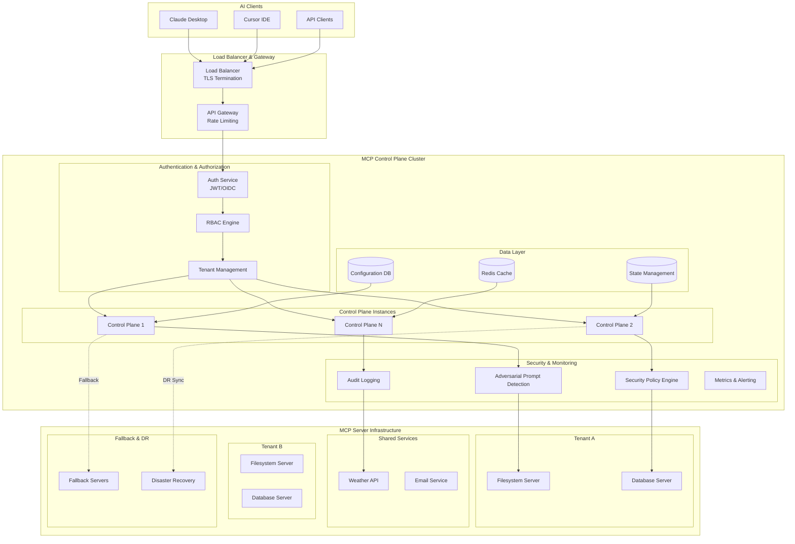

# MCP Control Plane [{Wizards 2025}](https://wizards.akamai.com/ideas/087a70000000z3VAAQ)

A centralized management system for Model Context Protocol (MCP) servers that provides secure, scalable, and enterprise-ready orchestration of AI tools and capabilities.

## Overview

The MCP Control Plane addresses the configuration chaos and security challenges that arise when managing multiple MCP servers across AI development workflows. It provides a transparent proxy layer that centralizes authentication, request routing, and server management while maintaining full compatibility with existing MCP clients like Claude Desktop and Cursor.

## Current Architecture

Our current implementation provides a solid foundation with the core components working together to create a seamless MCP management experience.

```mermaid
graph TB
    subgraph "AI Client (Claude Desktop/Cursor)"
        Client[AI Client]
    end
    
    subgraph "MCP Bridge Client"
        BridgeProcess[Bridge Process<br/>Python/UV]
        StdIO[stdin/stdout<br/>JSON-RPC 2.0]
        HTTPClient[HTTP Client<br/>Bearer Auth]
    end
    
    subgraph "MCP Control Plane Server"
        FastAPI[FastAPI Server<br/>Port 8444]
        Auth[Bearer Token Auth]
        Router[Request Router]
        MCPPool[MCP Client Pool]
        Config[YAML Configuration]
    end
    
    subgraph "MCP Servers"
        FS[Filesystem Server<br/>npx subprocess]
        DB[Database Server<br/>python subprocess]
        Custom[Custom Servers<br/>various runtimes]
    end
    
    Client --|JSON-RPC via stdio| StdIO
    StdIO --> BridgeProcess
    BridgeProcess --> HTTPClient
    HTTPClient --|HTTP POST/GET<br/>JSON payloads| FastAPI
    FastAPI --> Auth
    Auth --> Router
    Router --> MCPPool
    MCPPool --|JSON-RPC via stdio| FS
    MCPPool --|JSON-RPC via stdio| DB
    MCPPool --|JSON-RPC via stdio| Custom
    
    MCPPool --> Config
```

### Current Implementation Details

#### Communication Flow
1. **AI Client ↔ Bridge**: Standard MCP JSON-RPC 2.0 over stdin/stdout
2. **Bridge ↔ Control Plane**: HTTP REST API with JSON payloads and Bearer token authentication
3. **Control Plane ↔ MCP Servers**: Standard MCP JSON-RPC 2.0 over stdin/stdout subprocesses

#### Key Components

**Bridge Client**
- Transparent proxy maintaining MCP protocol compatibility
- Converts stdio JSON-RPC to HTTP requests
- Handles authentication token injection
- Provides error handling and connection management

**Control Plane Server**
- FastAPI-based HTTP server with structured logging
- Bearer token authentication middleware
- Request routing to appropriate MCP servers
- Subprocess management for MCP server lifecycle
- YAML-based configuration management

**MCP Client Pool**
- Manages subprocess connections to multiple MCP servers
- Tool discovery and registration from all connected servers
- Request routing based on tool ownership
- Health monitoring and automatic server restarts

#### Security Model
- **Authentication**: Statically configured Bearer tokens
- **Authorization**: Token-based access control to control plane
- **Process Isolation**: Each MCP server runs in separate subprocess
- **Configuration**: File-based server registry with enable/disable controls

## Enterprise Vision Architecture

The enterprise architecture extends our current foundation with advanced security, scalability, and operational capabilities.



### Enterprise Enhancements

#### Advanced Security
- **Adversarial Prompt Detection**: ML-based detection of prompt injection and jailbreak attempts
- **Security Policy Engine**: Fine-grained policies controlling tool access per tenant/user
- **Tenant Isolation**: Complete separation of MCP servers and data by organizational boundaries
- **Audit Trail**: Comprehensive logging of all tool invocations with attribution

#### Authentication & Authorization
- **OIDC/JWT Integration**: Enterprise SSO with token-based authentication
- **Role-Based Access Control**: Granular permissions for users, tools, and resources
- **API Key Management**: Programmatic access with scoped permissions
- **Multi-tenant Architecture**: Isolated environments for different organizations

#### Operational Excellence
- **High Availability**: Clustered control plane with load balancing
- **Auto-scaling**: Dynamic scaling based on load and tenant requirements
- **Health Monitoring**: Comprehensive metrics, alerting, and observability
- **Disaster Recovery**: Cross-region replication and automated failover

#### Inference Abuse Mitigation
- **Rate Limiting**: Per-tenant and per-user request throttling
- **Resource Quotas**: CPU, memory, and execution time limits per tool invocation
- **Cost Attribution**: Detailed usage tracking and billing by tenant
- **Anomaly Detection**: ML-based detection of unusual usage patterns

#### Tool Security & Governance
- **Tool Sandboxing**: Containerized execution environments with resource limits
- **Permission Boundaries**: Explicit allowlists for file system access, network calls, etc.
- **Tool Certification**: Approval workflows for custom MCP servers
- **Dependency Scanning**: Security analysis of MCP server dependencies

#### Fallback & Resilience
- **Circuit Breakers**: Automatic failure detection and traffic routing
- **Graceful Degradation**: Fallback to cached responses or alternative tools
- **Retry Strategies**: Intelligent retry with exponential backoff
- **Health Checks**: Continuous monitoring of MCP server availability

## Getting Started

### Current Implementation

1. **Install Dependencies**
   ```bash
   cd control_plane && uv sync
   cd ../bridge && uv sync
   ```

2. **Configure MCP Servers**
   Edit `control_plane/config/control_plane.yaml` to define your MCP servers

3. **Start Control Plane**
   ```bash
   cd control_plane
   uv run python src/control_plane_server.py
   ```

4. **Configure AI Client**
   Add bridge client to your Claude Desktop or Cursor configuration:
   ```json
   {
     "mcp-bridge": {
       "command": "uv",
       "args": ["--directory", "/path/to/bridge", "run", "bridge_client.py"]
     }
   }
   ```

### Configuration

The control plane uses YAML configuration for flexibility:

```yaml
server:
  host: "0.0.0.0"
  port: 8444

auth_tokens:
  - "your-secure-token-here"

mcp_servers:
  - id: "filesystem"
    name: "Filesystem Server"
    type: "npx"
    command: ["npx", "@modelcontextprotocol/server-filesystem", "/path"]
    enabled: true
```

## Security Considerations

### Current Implementation
- Use strong, unique Bearer tokens
- Run control plane on trusted networks
- Regularly rotate authentication tokens
- Monitor access logs for suspicious activity

### Enterprise Deployment
- Implement defense-in-depth security
- Use mutual TLS for service communication
- Deploy in private subnets with minimal exposure
- Regular security audits and penetration testing

## Roadmap

### Phase 1: Foundation ✅
- [x] Basic bridge client and control plane
- [x] Bearer token authentication
- [x] MCP server subprocess management
- [x] Tool discovery and routing

### Phase 2: Enhanced Operations
- [ ] Web-based management interface
- [ ] Metrics and monitoring integration
- [ ] Configuration hot-reloading
- [ ] Docker containerization

### Phase 3: Enterprise Features
- [ ] Multi-tenant architecture
- [ ] OIDC/JWT authentication
- [ ] Security policy engine
- [ ] High availability clustering

### Phase 4: Advanced Security
- [ ] Adversarial prompt detection
- [ ] Tool sandboxing and resource limits
- [ ] Audit logging and compliance
- [ ] Automated threat response

## Contributing

This repo is part of Wizards 2025 Idea.

## License

MIT License - see LICENSE file for details.
