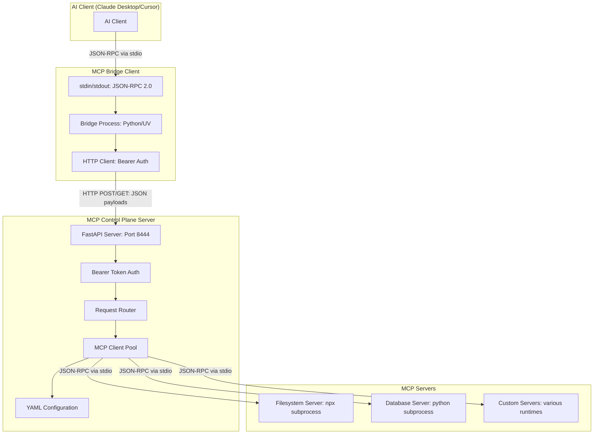

# MCP Control Plane [{Wizards 2025}](https://wizards.akamai.com/ideas/087a70000000z3VAAQ)

A centralized management system for Model Context Protocol (MCP) servers that provides secure, scalable, and enterprise-ready orchestration of AI tools and capabilities.

## Overview

The MCP Control Plane addresses the configuration chaos and security challenges that arise when managing multiple MCP servers across AI development workflows. It provides a transparent proxy layer that centralizes authentication, request routing, and server management while maintaining full compatibility with existing MCP clients like Claude Desktop and Cursor.

## Current Architecture

Our current implementation provides a solid foundation with the core components working together to create a seamless MCP management experience.


### Making a Initial Tools list call in Current implemantation


### Current Implementation Details

#### Communication Flow
1. **AI Client ↔ Bridge**: Standard MCP JSON-RPC 2.0 over stdin/stdout
2. **Bridge ↔ Control Plane**: HTTP REST API with JSON payloads and Bearer token authentication
3. **Control Plane ↔ MCP Servers**: Standard MCP JSON-RPC 2.0 over stdin/stdout subprocesses

#### Key Components

**Bridge Client**
- Transparent proxy maintaining MCP protocol compatibility
- Converts stdio JSON-RPC to HTTP requests
- Handles authentication token injection
- Provides error handling and connection management

**Control Plane Server**
- FastAPI-based HTTP server with structured logging
- Bearer token authentication middleware
- Request routing to appropriate MCP servers
- Subprocess management for MCP server lifecycle
- YAML-based configuration management

**MCP Client Pool**
- Manages subprocess connections to multiple MCP servers
- Tool discovery and registration from all connected servers
- Request routing based on tool ownership
- Health monitoring and automatic server restarts

#### Security Model
- **Authentication**: Statically configured Bearer tokens
- **Authorization**: Token-based access control to control plane
- **Process Isolation**: Each MCP server runs in separate subprocess
- **Configuration**: File-based server registry with enable/disable controls

## Getting Started

### Current Implementation

1. **Install Dependencies**
   ```bash
   cd control_plane && uv sync
   cd ../bridge && uv sync
   ```

2. **Configure MCP Servers**
   Edit `control_plane/config/control_plane.yaml` to define your MCP servers

3. **Start Control Plane**
   ```bash
   cd control_plane
   uv run python src/control_plane_server.py
   ```

4. **Configure AI Client**
   Add bridge client to your Claude Desktop or Cursor configuration:
   ```json
   {
     "mcp-bridge": {
       "command": "uv",
       "args": ["--directory", "/path/to/bridge", "run", "bridge_client.py"]
     }
   }
   ```

### Configuration

The control plane uses YAML configuration for flexibility:

```yaml
server:
  host: "0.0.0.0"
  port: 8444

auth_tokens:
  - "your-secure-token-here"

mcp_servers:
  - id: "filesystem"
    name: "Filesystem Server"
    type: "npx"
    command: ["npx", "@modelcontextprotocol/server-filesystem", "/path"]
    enabled: true
```

## Security Considerations

### Current Implementation
- Use strong, unique Bearer tokens
- Run control plane on trusted networks
- Regularly rotate authentication tokens
- Monitor access logs for suspicious activity


---------------------------------------------------------------------------------------------------------------------------------------------------------------------------------------------------------------------------------

