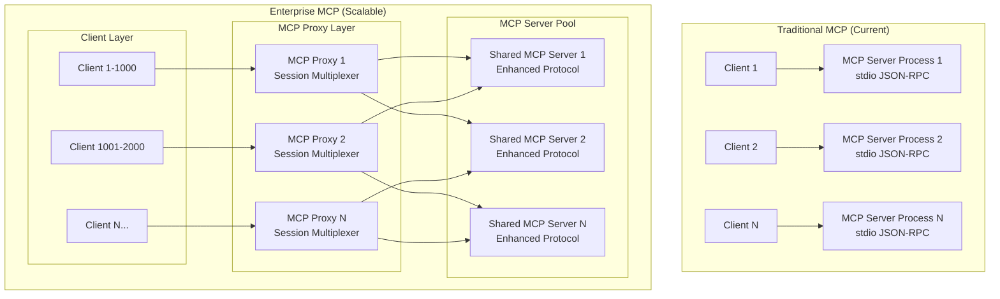

# MCP Control Plane [{Wizards 2025}](https://wizards.akamai.com/ideas/087a70000000z3VAAQ)

A centralized management system for Model Context Protocol (MCP) servers that provides secure, scalable, and enterprise-ready orchestration of AI tools and capabilities.

## Overview

The MCP Control Plane addresses the configuration chaos and security challenges that arise when managing multiple MCP servers across AI development workflows. It provides a transparent proxy layer that centralizes authentication, request routing, and server management while maintaining full compatibility with existing MCP clients like Claude Desktop and Cursor.

## Current Architecture

Our current implementation provides a solid foundation with the core components working together to create a seamless MCP management experience.


### Making a Initial Tools list call in Current implemantation


### Current Implementation Details

#### Communication Flow
1. **AI Client ↔ Bridge**: Standard MCP JSON-RPC 2.0 over stdin/stdout
2. **Bridge ↔ Control Plane**: HTTP REST API with JSON payloads and Bearer token authentication
3. **Control Plane ↔ MCP Servers**: Standard MCP JSON-RPC 2.0 over stdin/stdout subprocesses

#### Key Components

**Bridge Client**
- Transparent proxy maintaining MCP protocol compatibility
- Converts stdio JSON-RPC to HTTP requests
- Handles authentication token injection
- Provides error handling and connection management

**Control Plane Server**
- FastAPI-based HTTP server with structured logging
- Bearer token authentication middleware
- Request routing to appropriate MCP servers
- Subprocess management for MCP server lifecycle
- YAML-based configuration management

**MCP Client Pool**
- Manages subprocess connections to multiple MCP servers
- Tool discovery and registration from all connected servers
- Request routing based on tool ownership
- Health monitoring and automatic server restarts

#### Security Model
- **Authentication**: Statically configured Bearer tokens
- **Authorization**: Token-based access control to control plane
- **Process Isolation**: Each MCP server runs in separate subprocess
- **Configuration**: File-based server registry with enable/disable controls

## Getting Started

### Current Implementation

1. **Install Dependencies**
   ```bash
   cd control_plane && uv sync
   cd ../bridge && uv sync
   ```

2. **Configure MCP Servers**
   Edit `control_plane/config/control_plane.yaml` to define your MCP servers

3. **Start Control Plane**
   ```bash
   cd control_plane
   uv run python src/control_plane_server.py
   ```

4. **Configure AI Client**
   Add bridge client to your Claude Desktop or Cursor configuration:
   ```json
   {
     "mcp-bridge": {
       "command": "uv",
       "args": ["--directory", "/path/to/bridge", "run", "bridge_client.py"]
     }
   }
   ```

### Configuration

The control plane uses YAML configuration for flexibility:

```yaml
server:
  host: "0.0.0.0"
  port: 8444

auth_tokens:
  - "your-secure-token-here"

mcp_servers:
  - id: "filesystem"
    name: "Filesystem Server"
    type: "npx"
    command: ["npx", "@modelcontextprotocol/server-filesystem", "/path"]
    enabled: true
```

## Security Considerations

### Current Implementation
- Use strong, unique Bearer tokens
- Run control plane on trusted networks
- Regularly rotate authentication tokens
- Monitor access logs for suspicious activity


---------------------------------------------------------------------------------------------------------------------------------------------------------------------------------------------------------------------------------

## Enterprise Vision Architecture

The enterprise architecture extends our current foundation with advanced security, scalability, and operational capabilities.


### Tool calling Sequence in Enterpise Architecture


### Enterprise Enhancements

#### Advanced Security
- **Adversarial Prompt Detection**: ML-based detection of prompt injection and jailbreak attempts
- **Security Policy Engine**: Fine-grained policies controlling tool access per tenant/user
- **Tenant Isolation**: Complete separation of MCP servers and data by organizational boundaries
- **Audit Trail**: Comprehensive logging of all tool invocations with attribution

#### Authentication & Authorization
- **OIDC/JWT Integration**: Enterprise SSO with token-based authentication
- **Role-Based Access Control**: Granular permissions for users, tools, and resources
- **API Key Management**: Programmatic access with scoped permissions
- **Multi-tenant Architecture**: Isolated environments for different organizations

#### Operational Excellence
- **High Availability**: Clustered control plane with load balancing
- **Auto-scaling**: Dynamic scaling based on load and tenant requirements
- **Health Monitoring**: Comprehensive metrics, alerting, and observability
- **Disaster Recovery**: Cross-region replication and automated failover

#### Inference Abuse Mitigation
- **Rate Limiting**: Per-tenant and per-user request throttling
- **Resource Quotas**: CPU, memory, and execution time limits per tool invocation
- **Cost Attribution**: Detailed usage tracking and billing by tenant
- **Anomaly Detection**: ML-based detection of unusual usage patterns

#### Tool Security & Governance
- **Shared Server Sandboxing**: Containerized MCP servers handling multiple concurrent user sessions
- **Session Isolation**: Process-level isolation between user sessions within shared server instances
- **Permission Boundaries**: Per-session allowlists for file system access, network calls, etc.
- **Tool Certification**: Approval workflows for custom MCP servers with multi-tenancy support
- **Dependency Scanning**: Security analysis of MCP server dependencies and runtime environments
- **Resource Limits**: Per-session CPU, memory, and execution time quotas within shared servers

#### Fallback & Resilience
- **Circuit Breakers**: Automatic failure detection and traffic routing
- **Graceful Degradation**: Fallback to cached responses or alternative tools
- **Retry Strategies**: Intelligent retry with exponential backoff
- **Health Checks**: Continuous monitoring of MCP server availability

## Roadmap

### Phase 1: Foundation ✅
- [x] Basic bridge client and control plane
- [x] Bearer token authentication
- [x] MCP server subprocess management
- [x] Tool discovery and routing

### Phase 2: Enhanced Operations
- [ ] Web-based management interface
- [ ] Metrics and monitoring integration
- [ ] Configuration hot-reloading
- [ ] Docker containerization

### Phase 3: Enterprise Features
- [ ] Multi-tenant architecture
- [ ] OIDC/JWT authentication
- [ ] Security policy engine
- [ ] High availability clustering

### Phase 4: Advanced Security
- [ ] Adversarial prompt detection
- [ ] Tool sandboxing and resource limits
- [ ] Audit logging and compliance
- [ ] Automated threat response

## Contributing

This repo is part of Wizards 2025 Idea.

## Discussions

Discussion on Websocket Implemenation
https://github.com/modelcontextprotocol/modelcontextprotocol/discussions/220

Websocket implemenation (Not tested)
https://github.com/modelcontextprotocol/python-sdk/blob/main/src/mcp/client/websocket.py


### Enterprise Scalability Model (Still a Work in progress, Needs more Input)

The enterprise architecture is designed to handle millions of concurrent users through efficient resource sharing and intelligent scaling strategies:

#### MCP Protocol Adaptation for Scale

The traditional MCP stdio JSON-RPC model presents scalability challenges. Here's how we adapt it for enterprise scale:

#### Communication Strategies

**Strategy 1: MCP Proxy with Session Multiplexing**
- **MCP Proxy Layer**: Intermediary processes that maintain stdio connections to MCP servers
- **Session Identification**: Add session IDs to JSON-RPC requests to track user context
- **Connection Pooling**: Reuse stdio connections across multiple user sessions
- **Protocol Extension**: Extend MCP protocol with session management capabilities
  
**MCP Proxy Implementation:**
- **Stdio Connection Pool**: Maintain 10-50 stdio connections per MCP server type
- **Request Queue**: Queue user requests when all connections are busy
- **Session Context**: Inject user/tenant context into each request
- **Response Routing**: Route responses back to correct user session
- **Connection Health**: Monitor and restart failed MCP server processes



**Session-Aware JSON-RPC Protocol Extension:**
```json
{
  "jsonrpc": "2.0",
  "id": "req-123",
  "method": "tools/call",
  "params": {
    "name": "read_file",
    "arguments": {"path": "/tmp/file.txt"}
  },
  "session": {
    "user_id": "user-456",
    "tenant_id": "tenant-789",
    "session_id": "session-abc",
    "context": {"workspace": "/home/user"}
  }
}
```

**Strategy 2: Enhanced MCP Servers with Native Multi-tenancy**
- **Modified MCP Servers**: Enhance existing servers to handle session-aware requests
- **WebSocket/HTTP Upgrade**: Migrate from stdio to WebSocket/HTTP while maintaining JSON-RPC
- **Backward Compatibility**: Support both stdio and WebSocket protocols simultaneously
