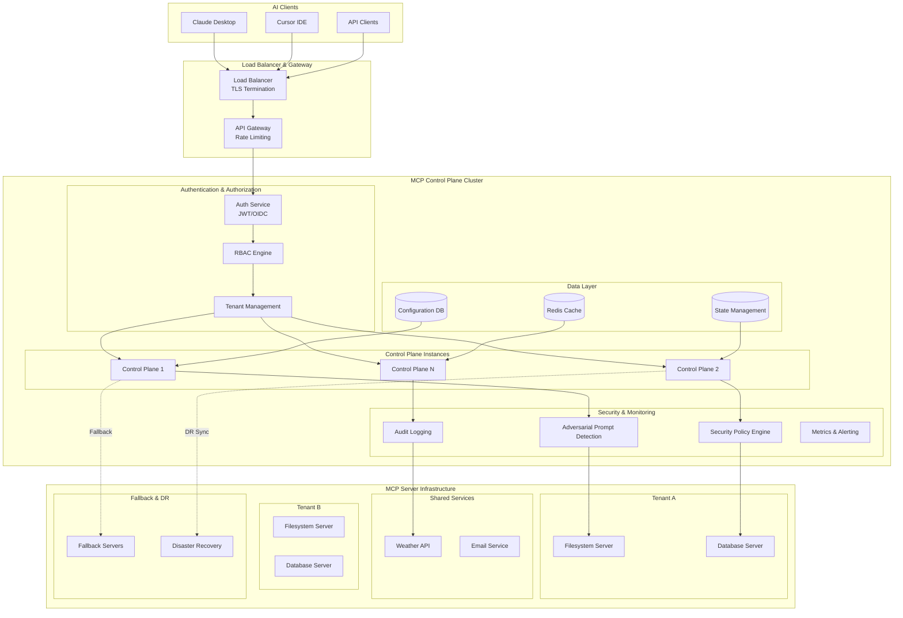
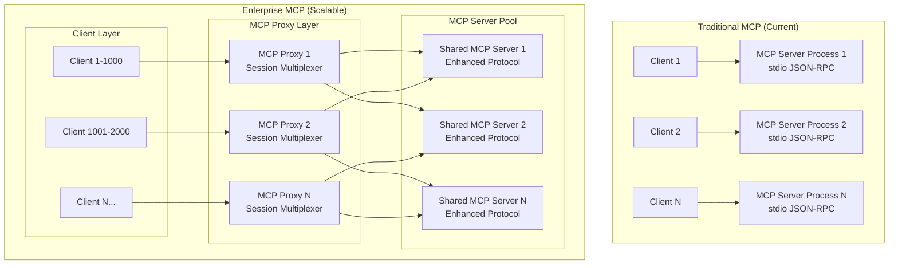

# Enterprise Vision Architecture

The enterprise architecture extends our current foundation with advanced security, scalability, and operational capabilities.



### Tool calling Sequence in Enterpise Architecture


### Enterprise Enhancements

#### Advanced Security
- **Adversarial Prompt Detection**: ML-based detection of prompt injection and jailbreak attempts
- **Security Policy Engine**: Fine-grained policies controlling tool access per tenant/user
- **Tenant Isolation**: Complete separation of MCP servers and data by organizational boundaries
- **Audit Trail**: Comprehensive logging of all tool invocations with attribution

#### Authentication & Authorization
- **OIDC/JWT Integration**: Enterprise SSO with token-based authentication
- **Role-Based Access Control**: Granular permissions for users, tools, and resources
- **API Key Management**: Programmatic access with scoped permissions
- **Multi-tenant Architecture**: Isolated environments for different organizations

#### Operational Excellence
- **High Availability**: Clustered control plane with load balancing
- **Auto-scaling**: Dynamic scaling based on load and tenant requirements
- **Health Monitoring**: Comprehensive metrics, alerting, and observability
- **Disaster Recovery**: Cross-region replication and automated failover

#### Inference Abuse Mitigation
- **Rate Limiting**: Per-tenant and per-user request throttling
- **Resource Quotas**: CPU, memory, and execution time limits per tool invocation
- **Cost Attribution**: Detailed usage tracking and billing by tenant
- **Anomaly Detection**: ML-based detection of unusual usage patterns

#### Tool Security & Governance
- **Shared Server Sandboxing**: Containerized MCP servers handling multiple concurrent user sessions
- **Session Isolation**: Process-level isolation between user sessions within shared server instances
- **Permission Boundaries**: Per-session allowlists for file system access, network calls, etc.
- **Tool Certification**: Approval workflows for custom MCP servers with multi-tenancy support
- **Dependency Scanning**: Security analysis of MCP server dependencies and runtime environments
- **Resource Limits**: Per-session CPU, memory, and execution time quotas within shared servers

#### Fallback & Resilience
- **Circuit Breakers**: Automatic failure detection and traffic routing
- **Graceful Degradation**: Fallback to cached responses or alternative tools
- **Retry Strategies**: Intelligent retry with exponential backoff
- **Health Checks**: Continuous monitoring of MCP server availability

## Roadmap

### Phase 1: Foundation ✅
- [x] Basic bridge client and control plane
- [x] Bearer token authentication
- [x] MCP server subprocess management
- [x] Tool discovery and routing

### Phase 2: Enhanced Operations
- [ ] Web-based management interface
- [ ] Metrics and monitoring integration
- [ ] Configuration hot-reloading
- [ ] Docker containerization

### Phase 3: Enterprise Features
- [ ] Multi-tenant architecture
- [ ] OIDC/JWT authentication
- [ ] Security policy engine
- [ ] High availability clustering

### Phase 4: Advanced Security
- [ ] Adversarial prompt detection
- [ ] Tool sandboxing and resource limits
- [ ] Audit logging and compliance
- [ ] Automated threat response

## Contributing

This repo is part of Wizards 2025 Idea.

## Discussions

Discussion on Websocket Implemenation
https://github.com/modelcontextprotocol/modelcontextprotocol/discussions/220

Websocket implemenation (Not tested)
https://github.com/modelcontextprotocol/python-sdk/blob/main/src/mcp/client/websocket.py


### Enterprise Scalability Model (Still a Work in progress, Needs more Input)

The enterprise architecture is designed to handle millions of concurrent users through efficient resource sharing and intelligent scaling strategies:

#### MCP Protocol Adaptation for Scale

The traditional MCP stdio JSON-RPC model presents scalability challenges. Here's how we adapt it for enterprise scale:

#### Communication Strategies

**Strategy 1: MCP Proxy with Session Multiplexing**
- **MCP Proxy Layer**: Intermediary processes that maintain stdio connections to MCP servers
- **Session Identification**: Add session IDs to JSON-RPC requests to track user context
- **Connection Pooling**: Reuse stdio connections across multiple user sessions
- **Protocol Extension**: Extend MCP protocol with session management capabilities
  
**MCP Proxy Implementation:**
- **Stdio Connection Pool**: Maintain 10-50 stdio connections per MCP server type
- **Request Queue**: Queue user requests when all connections are busy
- **Session Context**: Inject user/tenant context into each request
- **Response Routing**: Route responses back to correct user session
- **Connection Health**: Monitor and restart failed MCP server processes



**Session-Aware JSON-RPC Protocol Extension:**
```json
{
  "jsonrpc": "2.0",
  "id": "req-123",
  "method": "tools/call",
  "params": {
    "name": "read_file",
    "arguments": {"path": "/tmp/file.txt"}
  },
  "session": {
    "user_id": "user-456",
    "tenant_id": "tenant-789",
    "session_id": "session-abc",
    "context": {"workspace": "/home/user"}
  }
}
```

**Strategy 2: Enhanced MCP Servers with Native Multi-tenancy**
- **Modified MCP Servers**: Enhance existing servers to handle session-aware requests
- **WebSocket/HTTP Upgrade**: Migrate from stdio to WebSocket/HTTP while maintaining JSON-RPC
- **Backward Compatibility**: Support both stdio and WebSocket protocols simultaneously


# Enterprise MCP Control Plane: Architectural Challenges

This outlines the critical architectural challenges involved in designing and implementing an enterprise-grade Multi-functional Capability Plane (MCP) Control Plane. Moving beyond simple request routing, a robust control plane must function as an intelligent orchestration system that actively manages security, reliability, state, and cost across a complex ecosystem of models, tools, and tenants.

---

##  Core Architectural Concerns

### 1. Model Consistency and Behavioral Variations
* **Challenge**: Different AI models interpret the same tool definitions in varied ways based on their training and architecture, leading to inconsistent behavior. A model might misuse a `read_file` tool for system reconnaissance instead of its intended purpose.
* **Architectural Solution**: The control plane must perform **semantic intent analysis** by learning from historical usage patterns. This allows it to flag anomalous tool invocations that don't align with successful, legitimate use cases, creating a feedback loop to enforce consistency.

### 2. Inference Abuse and Security Orchestration
* **Challenge**: Securing the system against adversarial prompts, hidden adversarial goals within tool calls, and vulnerabilities introduced by tool version changes.
* **Architectural Solution**: Implement a multi-layered security strategy:
    * **Adversarial Prompt Detection**: Use ML classifiers to identify prompt injection and social engineering attempts at the input layer.
    * **Intent-Action Validation**: Ensure tool invocations semantically align with the user's stated objectives.
    * **Dynamic Authorization**: Evaluate permissions based on context (time, request patterns, data sensitivity), not just static user roles.
    * **Continuous Validation**: Constantly check tools against a canonical registry to mitigate risks from **tool definition version drift**.

### 3. Resilience and Graceful Degradation
* **Challenge**: Maintaining user experience and continuity during partial or full system failures. A failure in one tool within a chain can cause the entire request to fail.
* **Architectural Solution**:
    * **Intelligent Fallback Chains**: Automatically substitute a failing tool with a semantically equivalent one (e.g., swapping a database query tool for a filesystem search tool).
    * **Partial Success Handling**: Instead of failing an entire workflow, return partial results with clear indicators of what succeeded and what failed.
    * **Response Validation**: Ensure that even successful tool executions produce semantically correct and safe outputs before they are sent to the user.

### 4. State Management and Session Continuity
* **Challenge**: Managing stateful tool interactions (e.g., file handles, database connections) across a stateless, multi-tenant server architecture.
* **Architectural Solution**: The control plane must orchestrate state isolation and persistence. This requires **session affinity** (sticky sessions) to route a user's requests to the same instance, dynamic routing optimizations, and persisting session context to enable seamless **failure recovery** without losing user context.

### 5. Tool Interdependencies and Workflow Orchestration
* **Challenge**: Managing complex workflows where the output of one tool is the input for another, especially when steps are distributed across different servers or resources.
* **Architectural Solution**: The control plane needs sophisticated **dependency tracking** to manage the entire workflow. It must optimize resource allocation, manage contention, and be capable of initiating **compensating actions or rollbacks** if a step in a stateful workflow fails.

### 6. Resource Contention and Fair Scheduling
* **Challenge**: Fairly allocating shared resources (CPU, memory, external APIs, databases) among multiple tenants who have different SLA requirements and usage patterns.
* **Architectural Solution**: Move beyond simple round-robin scheduling. The architecture requires **dynamic priority adjustment** based on tenant agreements, real-time system performance, and resource consumption patterns to prevent any single tenant from starving others.

### 7. Protocol Evolution and Backward Compatibility
* **Challenge**: The ecosystem will have clients, servers, and tools running on different protocol versions, leading to compatibility issues in syntax and semantics.
* **Architectural Solution**: The control plane must act as a **translation layer**. It needs to understand multiple protocol versions simultaneously, converting requests and responses between different formats to ensure seamless communication and backward compatibility across the ecosystem.

### 8. Observability and Debugging in a Distributed Context
* **Challenge**: Gaining clear visibility for debugging when a single request's context is fragmented across multiple services, servers, and security layers.
* **Architectural Solution**: Implement **comprehensive observability** using **distributed tracing**. This system must reconstruct and correlate events across all layers to provide complete request flows, offering tailored visibility for developers (tool behavior), operators (performance metrics), and security teams (audit trails).

### 9. Economic Models and Cost Attribution
* **Challenge**: Accurately measuring and attributing the costs of compute, external API credits, and infrastructure capacity to the correct tenants in a shared resource model.
* **Architectural Solution**: The control plane must support **fine-grained cost attribution**. This involves implementing fair cost-sharing mechanisms that can handle complex consumption patterns (e.g., expensive initializations vs. cheap incremental operations) and incentivize efficient resource usage.
